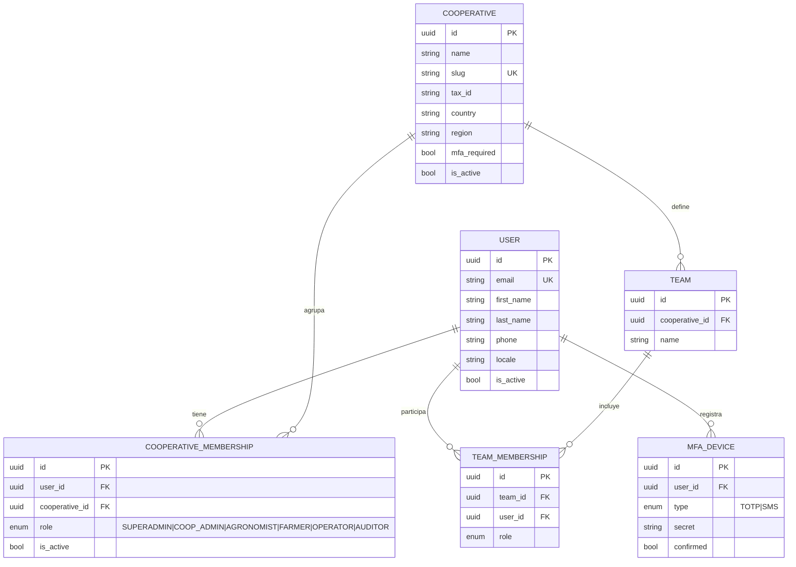
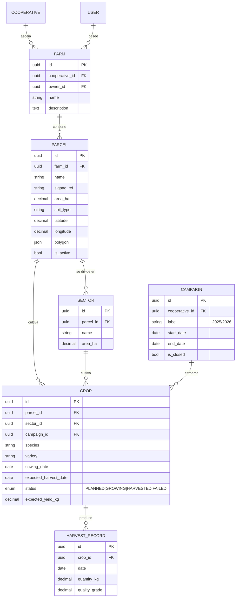
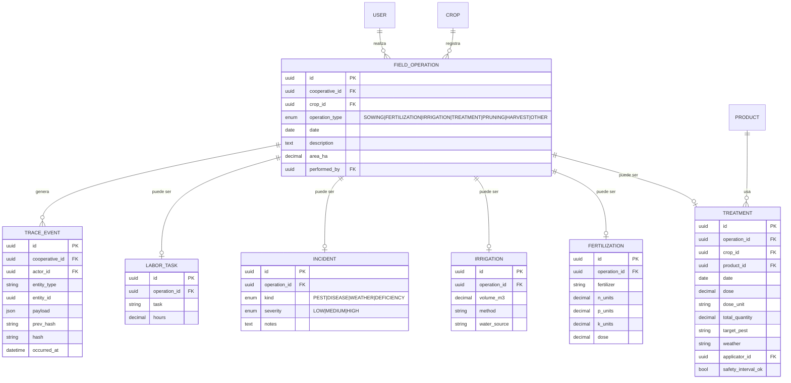
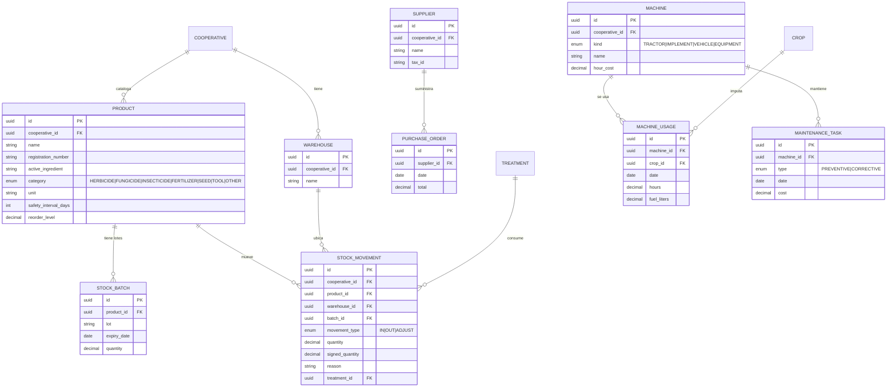

# Modelo de Datos Completo

Modelo conceptual/lógico de todas las entidades, sus atributos clave y relaciones.
Toda entidad de dominio incluye `id (UUID)`, `created_at`, `updated_at` y, salvo las
globales, `cooperative_id` (aislamiento multi-tenant).

> Leyenda relaciones: `||--o{` = uno a muchos · `}o--o{` = muchos a muchos ·
> `||--||` = uno a uno.

---

## 1. Núcleo: Identidad y Tenant

---

## 2. Explotación: Fincas → Parcelas → Sectores → Cultivos

---

## 3. Cuaderno de campo y Trazabilidad

---

## 4. Inventario y Maquinaria

---

## 5. Costes, IA, Memoria, Alertas, Documentos, Integraciones

```mermaid
erDiagram
    CROP ||--o{ COST_ENTRY : "acumula"
    CROP ||--o| PROFITABILITY_REPORT : "resume"
    AGENT ||--o{ AGENT_RUN : "ejecuta"
    AGENT_RUN ||--o{ AGENT_MESSAGE : "contiene"
    AGENT_RUN ||--o{ TOOL_INVOCATION : "invoca"
    AGENT_RUN ||--o| IMAGE_ANALYSIS : "produce"
    COOPERATIVE ||--o{ MEMORY_ENTRY : "acumula"
    COOPERATIVE ||--o{ ALERT_RULE : "define"
    ALERT_RULE ||--o{ ALERT : "dispara"
    ALERT ||--o{ ALERT_DELIVERY : "entrega"
    COOPERATIVE ||--o{ DOCUMENT : "almacena"
    DOCUMENT ||--o| OCR_RESULT : "extrae"
    COOPERATIVE ||--o{ INTEGRATION : "configura"
    INTEGRATION ||--o{ DEVICE_READING : "ingresa"
    PARCEL ||--o{ DEVICE_READING : "mide"
    PARCEL ||--o{ SATELLITE_INDEX : "observa"

    COST_ENTRY {
        uuid id PK
        uuid cooperative_id FK
        uuid crop_id FK
        enum category "LABOR|PRODUCT|MACHINE|WATER|ELECTRICITY|OTHER"
        decimal amount
        date date
    }
    PROFITABILITY_REPORT {
        uuid id PK
        uuid crop_id FK
        decimal total_cost
        decimal income
        decimal profit
        decimal cost_per_ha
    }
    AGENT {
        uuid id PK
        uuid cooperative_id FK
        enum agent_type "AGRONOMIST|PEST|ADMIN|COOPERATIVE|SUPPORT"
        string name
        text purpose
        string model
        json skills
        json tools
        json listens_to
        bool is_active
    }
    AGENT_RUN {
        uuid id PK
        uuid agent_id FK
        uuid user_id FK
        enum status "PENDING|RUNNING|COMPLETED|FAILED"
        text input_text
        text output_text
        int tokens_used
    }
    AGENT_MESSAGE {
        uuid id PK
        uuid run_id FK
        enum role "system|user|assistant|tool"
        text content
        string tool_name
    }
    IMAGE_ANALYSIS {
        uuid id PK
        uuid run_id FK
        string image_url
        string diagnosis
        decimal probability
        enum severity "LOW|MEDIUM|HIGH"
        text recommended_treatment
    }
    MEMORY_ENTRY {
        uuid id PK
        uuid cooperative_id FK
        enum scope "USER|PARCEL|GLOBAL"
        uuid user_id FK
        uuid parcel_id FK
        uuid crop_id FK
        text content
        json data
        json tags
        int importance
        string source
    }
    ALERT_RULE {
        uuid id PK
        uuid cooperative_id FK
        enum trigger "WEATHER|PEST|EXPIRY|COMPLIANCE|STOCK|PRODUCTION|MAINTENANCE"
        json condition
        enum severity
    }
    ALERT {
        uuid id PK
        uuid rule_id FK
        text message
        enum severity
        bool acknowledged
    }
    ALERT_DELIVERY {
        uuid id PK
        uuid alert_id FK
        enum channel "EMAIL|SMS|WHATSAPP|PUSH"
        enum status "PENDING|SENT|FAILED"
    }
    DOCUMENT {
        uuid id PK
        uuid cooperative_id FK
        enum doc_class "INVOICE|CERTIFICATE|CONTRACT|INSPECTION|PHOTO|OTHER"
        string file_url
        uuid linked_entity_id
    }
    OCR_RESULT {
        uuid id PK
        uuid document_id FK
        text raw_text
        json fields
    }
    INTEGRATION {
        uuid id PK
        uuid cooperative_id FK
        enum kind "IOT|WEATHER|SATELLITE|DRONE|ERP|WHATSAPP"
        json config
        bool is_active
    }
    DEVICE_READING {
        uuid id PK
        uuid integration_id FK
        uuid parcel_id FK
        string metric
        decimal value
        datetime measured_at
    }
    SATELLITE_INDEX {
        uuid id PK
        uuid parcel_id FK
        enum index_type "NDVI|NDWI"
        decimal value
        date date
    }
```

---

## 6. Resumen de relaciones clave

- **USER ⟷ COOPERATIVE** (N:M vía `COOPERATIVE_MEMBERSHIP` con rol) → multi-tenant.
- **FARM → PARCEL → SECTOR → CROP** → jerarquía de explotación.
- **CROP → FIELD_OPERATION** (1:N) y cada operación se especializa (treatment, fertilization…).
- **TREATMENT → STOCK_MOVEMENT** (consumo automático) → inventario consistente.
- Toda escritura de dominio → **TRACE_EVENT** (append-only, hash-chained) → trazabilidad.
- **CROP → COST_ENTRY → PROFITABILITY_REPORT** → costes y rentabilidad.
- **AGENT → AGENT_RUN → {AGENT_MESSAGE, TOOL_INVOCATION, IMAGE_ANALYSIS}** → IA auditable.
- **MEMORY_ENTRY** con scope USER/PARCEL/GLOBAL → memoria de 3 niveles.
- **ALERT_RULE → ALERT → ALERT_DELIVERY** → alertas multicanal.
- **INTEGRATION → {DEVICE_READING, SATELLITE_INDEX}** asociadas a PARCEL → datos externos.

---

## 7. Estado actual de implementación (backend)

Ya implementado en el código: `User`, `Cooperative`, `CooperativeMembership`, `Farm`,
`Parcel`, `Crop`, `FieldOperation`, `Treatment`, `Product`, `StockMovement`, `MemoryEntry`,
`Agent`, `AgentRun`, `AgentMessage`.

Pendiente (diseñado aquí, a implementar por fases): `Sector`, `Campaign`, `HarvestRecord`,
`Fertilization`, `Irrigation`, `Incident`, `LaborTask`, `TraceEvent`, `StockBatch`,
`Warehouse`, `Supplier`, `PurchaseOrder`, `Machine`, `MachineUsage`, `MaintenanceTask`,
`CostEntry`, `ProfitabilityReport`, `ImageAnalysis`, `AlertRule`, `Alert`, `AlertDelivery`,
`Document`, `OcrResult`, `Integration`, `DeviceReading`, `SatelliteIndex`, `Team`, `MfaDevice`.
