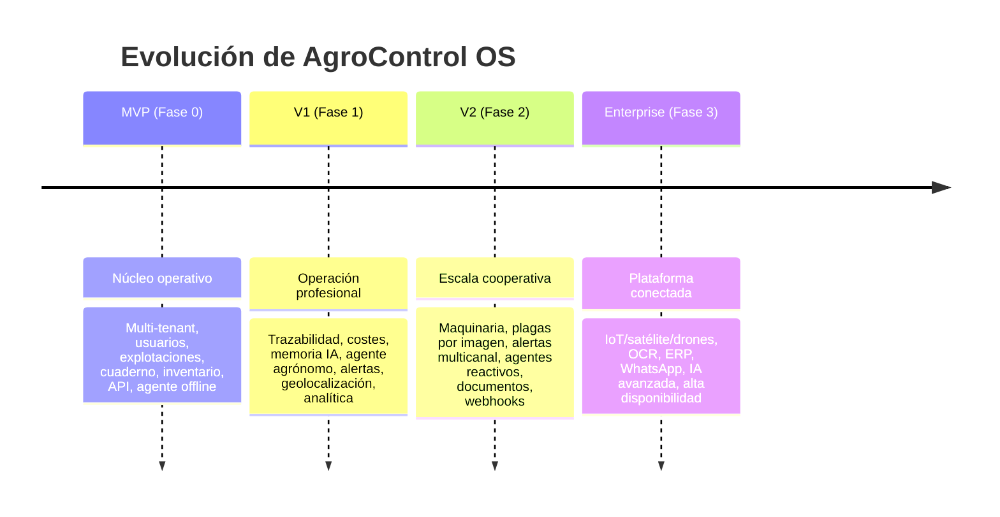

# Roadmap MVP → Enterprise

Estrategia de evolución en 4 fases con criterios de salida (Definition of Done) por fase.
Cada fase entrega valor utilizable y construye sobre la anterior.

---

## Fase 0 — MVP (Núcleo operativo) ✅ _en gran parte ya implementado_

**Objetivo:** sustituir el cuaderno en papel con una plataforma multi-tenant funcional.

**Alcance:**

- Usuarios, autenticación JWT, 6 roles, pertenencia multi-cooperativa.
- Aislamiento de tenant (`X-Cooperative`).
- Explotaciones: finca → parcela → cultivo (CRUD).
- Cuaderno de campo: operaciones + tratamientos/abonado/riego.
- Inventario básico: catálogo + movimientos de stock.
- API REST documentada (OpenAPI).
- Agente IA con fallback offline determinista.
- Despliegue Docker (PostgreSQL en todos los entornos), demo seed.

**Requisitos cubiertos:** RF-USR-1..4,6 · RF-COOP-1..3 · RF-FARM-1 · RF-FIELD-1,2 · RF-INV-1,2 · RF-AI-4 · RF-INT-1.

**DoD:** un técnico crea cooperativa, fincas y parcelas, y registra operaciones; stock se actualiza; API y agente offline operativos en Docker.

---

## Fase 1 — V1 (Operación profesional)

**Objetivo:** convertir registros en inteligencia y cumplimiento normativo.

**Alcance:**

- Trazabilidad append-only con hash-chain.
- Sectores, campañas, registro de cosechas.
- Geolocalización y SIGPAC en parcelas.
- Descuento automático de stock por tratamiento + lotes/caducidad (FEFO).
- Validación de plazos de seguridad; exportación de cuaderno oficial (PDF).
- Costes y rentabilidad por cultivo (coste/ha).
- Memoria IA en 3 niveles + agente agrónomo con contexto real.
- Alertas por reglas (stock, caducidad, meteo básica).
- Dashboards por rol + exportación CSV/Excel.
- MFA configurable, auditoría de accesos.

**Requisitos cubiertos:** RF-TRACE-1..3 · RF-FARM-2..5 · RF-INV-3..5 · RF-FIELD-3,4 · RF-COST-1,2 · RF-MEM-1,2 · RF-AI-1,2 · RF-ALERT-1 · RF-AN-1,2 · RF-USR-5,7.

**DoD:** trazabilidad verificable de un lote; informe de rentabilidad; el agente responde con datos reales de la explotación; cuaderno oficial exportable.

---

## Fase 2 — V2 (Escala cooperativa)

**Objetivo:** soportar cooperativas grandes con automatización y comunicación.

**Alcance:**

- Maquinaria: inventario, uso imputado, mantenimientos.
- Detección de plagas por imagen (agente de visión).
- Agentes reactivos a eventos (`listens_to`).
- Alertas multicanal (SMS/WhatsApp/push) con acuse y escalado.
- Comunicados de cooperativa (broadcast).
- Gestión documental vinculada a entidades.
- API keys y webhooks por cooperativa.
- Comparativa entre campañas y cuadro de mando agregado de cooperativa.
- Sincronización offline del cuaderno.

**Requisitos cubiertos:** RF-MACH-1..3 · RF-AI-3,5 · RF-ALERT-2,3 · RF-COOP-4 · RF-DOC-1 · RF-INT-2 · RF-COST-3 · RF-AN-3 · RF-FIELD-5 · RF-MEM-3 · RF-TRACE-4.

**DoD:** una incidencia de plaga detectada por foto dispara alerta multicanal y queda registrada; cooperativa consulta KPIs agregados; integraciones externas vía webhook.

---

## Fase 3 — Enterprise (Plataforma conectada)

**Objetivo:** agricultura de precisión conectada y lista para grandes clientes.

**Alcance:**

- Ingesta IoT (sensores de suelo/clima) por parcela.
- Índices satelitales (NDVI/NDWI) y soporte de drones.
- OCR de facturas y certificados.
- Conectores ERP y WhatsApp Business.
- IA avanzada: predicción de rendimiento, recomendación proactiva.
- Alta disponibilidad 99,9%, observabilidad completa, multi-región.

**Requisitos cubiertos:** RF-INT-3,4 · RF-DOC-2 · RNF-AVAIL-1 · RNF-OBS-1..3.

**DoD:** datos de sensores y satélite alimentan recomendaciones del agente; facturas digitalizadas por OCR alimentan costes; SLA 99,9% verificado.

---

## Priorización (matriz valor / esfuerzo)

| Iniciativa                           | Valor | Esfuerzo |    Fase    |
| ------------------------------------ | :---: | :------: | :--------: |
| Multi-tenant + cuaderno + inventario | Alto  |  Medio   |    MVP     |
| Agente offline                       | Alto  |   Bajo   |    MVP     |
| Trazabilidad hash-chain              | Alto  |  Medio   |     V1     |
| Costes y rentabilidad                | Alto  |  Medio   |     V1     |
| Memoria IA + agente agrónomo         | Alto  |   Alto   |     V1     |
| FEFO + plazos de seguridad           | Alto  |   Bajo   |     V1     |
| Plagas por imagen                    | Medio |   Alto   |     V2     |
| Alertas multicanal                   | Medio |  Medio   |     V2     |
| Maquinaria                           | Medio |  Medio   |     V2     |
| IoT / satélite                       | Alto  |   Alto   | Enterprise |
| OCR + ERP + WhatsApp                 | Medio |   Alto   | Enterprise |

**Criterio:** maximizar valor temprano con bajo/medio esfuerzo (MVP/V1), reservar alto
esfuerzo de alto valor (IoT, IA avanzada) para fases con base sólida.
