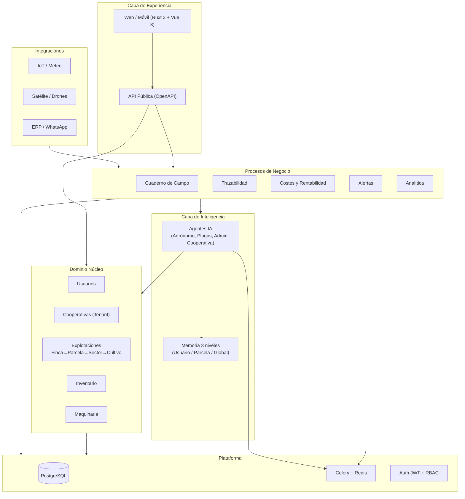

# AgroControl OS — Diseño de Producto (Nivel Empresarial)

Sistema operativo agrícola SaaS multi-tenant para cooperativas: digitaliza la explotación
de extremo a extremo (campo, inventario, costes, trazabilidad) y añade una capa de
inteligencia con agentes de IA y memoria contextual.

---

## Índice de documentos

| #   | Documento                                         | Contenido                                                                                             |
| --- | ------------------------------------------------- | ----------------------------------------------------------------------------------------------------- |
| 00  | [Visión y arquitectura funcional](00-overview.md) | Visión, problemas del sector, personas, arquitectura por capas, mapa de 14 módulos, modelo de negocio |
| 01  | [Detalle de módulos](01-modules.md)               | Funcionalidad, reglas de negocio, entidades y eventos de los 14 módulos                               |
| 02  | [Roles y permisos](02-roles-permissions.md)       | 6 roles, principios de autorización, matriz de permisos                                               |
| 03  | [Casos de uso](03-use-cases.md)                   | Casos de uso UC-1..UC-14 con flujos                                                                   |
| 04  | [Historias de usuario](04-user-stories.md)        | Épicas e historias con criterios de aceptación, MoSCoW y fase                                         |
| 05  | [Modelo de datos](05-data-model.md)               | Entidades, atributos, relaciones y diagramas ER                                                       |
| 06  | [Requisitos](06-requirements.md)                  | Requisitos funcionales y no funcionales                                                               |
| 07  | [Roadmap](07-roadmap.md)                          | Evolución MVP → V1 → V2 → Enterprise y priorización                                                   |

---

## Mapa conceptual

---

## Resumen de fases

- **MVP** ✅ — Núcleo multi-tenant, cuaderno, inventario, API, agente offline (en gran parte implementado).
- **V1** — Trazabilidad, costes, memoria IA, agente agrónomo real, alertas, analítica.
- **V2** — Maquinaria, plagas por imagen, alertas multicanal, agentes reactivos, documentos, webhooks.
- **Enterprise** — IoT, satélite, OCR, ERP, IA avanzada, alta disponibilidad.

Detalle completo en [07-roadmap.md](07-roadmap.md).

---

## Stack tecnológico

| Capa              | Tecnología                                                      |
| ----------------- | --------------------------------------------------------------- |
| Backend           | Django 5 + DRF + SimpleJWT                                      |
| Asíncrono         | Celery + Redis                                                  |
| Datos             | PostgreSQL 16                                                   |
| Frontend          | Nuxt 3 + Vue 3 + Pinia + TailwindCSS                            |
| IA                | Agentes con registro de herramientas (ReAct) + fallback offline |
| Despliegue        | Docker Compose (PostgreSQL en todos los entornos)               |
| Documentación API | drf-spectacular (OpenAPI)                                       |

> **Estado del proyecto:** backend núcleo implementado y validado, corriendo en Docker con
> datos demo. Esta carpeta documenta el **diseño completo de producto** previo a la
> implementación de las fases V1–Enterprise.
